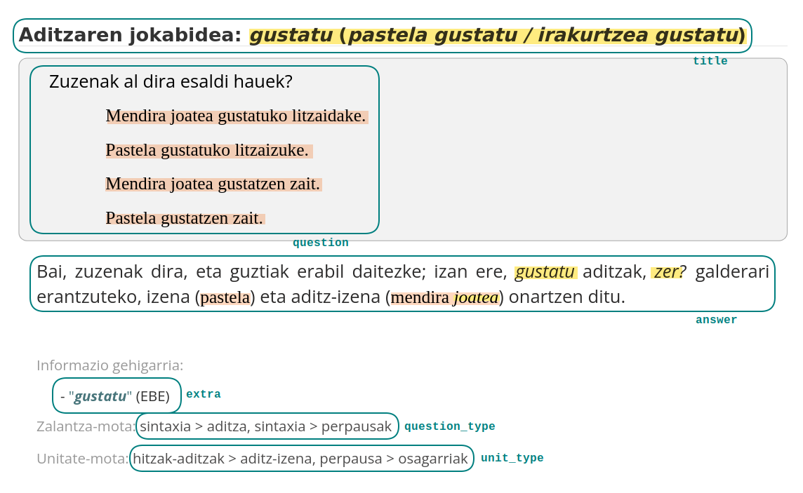

### Introduction

This repository contains a Python script to download [JAGONET](https://www.euskaltzaindia.eus/index.php?option=com_jagonet) questions and answers.

JAGONET is a language consultation service that Euskaltzaindia makes available to citizens via the Internet.
The purpose of the service is to promote the correct and proper use of the Basque language. 
It is responsible for issuing language instructions and for answering citizens' questions about the language.

JAGONET content is published under a [CC BY-NC-SA 4.0](https://creativecommons.org/licenses/by-nc-sa/4.0/) license.

### Output

The output of the program is a collection of Q&A records with the fields illustrated in the following capture:



In addition to those, each record includes the `url` to the corresponding webpage and its `id`.

As can be seen in the capture, the main fields (i.e., `title`, `question`, and `answer`) use formatting to indicate metalinguistic references.
These have been maintained as HTML tags: `<em></em>` and `<adib></adib>`, respectively, for the expressions in yellow and orange shown in the capture. 

The output is written in JSONLines format and, optionally, also as a CSV file.

### Usage

```text
usage: download.py [-h] [--root_url ROOT_URL] [--output_path OUTPUT_PATH] [--max_workers MAX_WORKERS] [--dump_csv]

Download Jagonet Q&A from the web

options:
  --root_url ROOT_URL       Specify the root URL. Default: https://www.euskaltzaindia.eus/index.php?option=com_jagonet&task=gaiak
  --output_path OUTPUT_PATH Specify the output file path. Default: ./jagonet.jsonl
  --max_workers MAX_WORKERS Specify the number of workers. Default: 16
  --dump_csv                Specify whether to dump the data as a CSV file, in addition to the JSONLines file. Default: false
```
